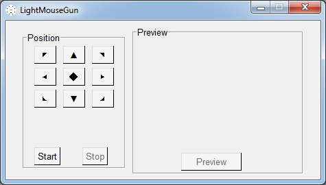
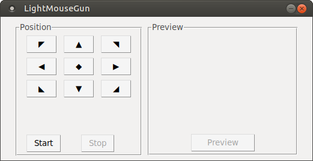
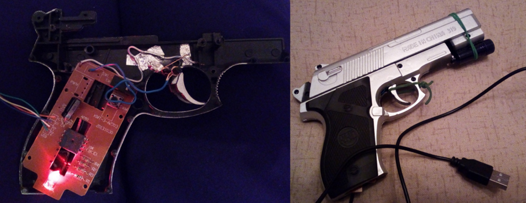
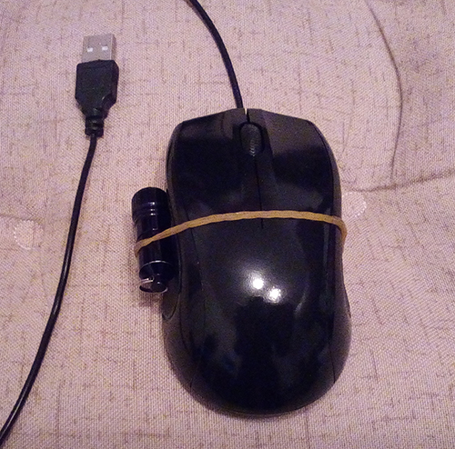

## About
**LightMouseGun** is a program that controls the mouse with light. It aims to let you play light gun shooter games on newer displays simulating the unique experience of the classic light gun games (like Duck Hunt for NES).

## Usage



Press **START** to start your webcam

Select one of the positions (by default the middle bottom one is selected). The position defines the region which the camera sees.

Point a light towards the camera lense.

Press **PREVIEW** to see what the camera sees. That's optional.

WHAT ABOUT CLICKING? This program is **_SPECIFICALLY_** written for light gun shooter games. As such you would want to click/shoot with something that has a button/trigger. Moreover, this program is tested with FCEUX and Nestopia (NES emulators) which, for some reason, register only hardware input. Not simulated clicks.

So what can you do about this? Here's an example:


But if that's too much for you, then how about this:



- USB mouse.
- Flashlight.
- Rubber band.

## IMPORTANT:
In low lit conditions the light tracking is a bit laggy. Just a bit but enough to feel it. That's due to the exposure settings on the webcam. The solution is to turn off the exposure.
- Linux users can use *v4l2-ctl*. The command is `v4l2-ctl --set-ctrl exposure_auto_priority=0'`. You can turn it on again later.
- Windows users can use software such as *MyCam*.

## Known issues:
- Does not work with full-screen applications. At least in linux. Don't know about Windows.
- Colors in the preview window are a bit messed up but that's a minor problem and does not impede the program usage.
---
_DEVELOPER NOTE:_
To setup the project in Linux run the following commands in terminal in the `src` folder:
```
python3 -m venv venv
source venv/bin/activate
pip install -r requirements.txt
```

To setup the project in Windows run the following commands in terminal in the `src` folder:
```
pip install virtualenv
virtualenv venv
venv\Scripts\activate
pip install -r requirements.txt
```
These commands will create a virtual environment in `venv` folder and install the needed dependencies. You'll need to have `python3-env` installed. And `python3-tk`. For both Operating Systems, things might differ.

To build the project run:
```
pyinstaller --onefile --windowed --clean main.py
```
The executable will appear in the dist folder.

**Note**: For building in Windows you'll need ***api-ms-win-downlevel-shlwapi-l1-1-0.dll***.
After you create the virtual environment (venv), put the dll in `src\venv\Lib\site-packages\cv2`.
