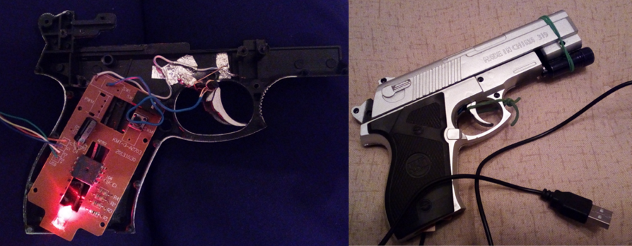

## About
**LightMouseGun** is a program that controls the mouse with light. It aims to let you play light gun shooter games on newer displays simulating the unique experience of the classic light gun games (like Duck Hunt for NES).

## Usage


Press **START** to start your webcam

Select one of the positions (by default the middle bottom one is selected). The position defines the region which the camera sees.

Point a light towards the camera lense.

Press **PREVIEW** to see what the camera sees. That's optional.

WHAT ABOUT CLICKING? This program is **_SPECIFICALLY_** written for light gun shooter games. As such you would want to click/shoot with something that looks like a gun and has a trigger. Moreover, this program is tested with FCEUX and Nestopia (NES emulators) which, for some reason, register only hardware input. Not simulated clicks.

So what can you do about this? Here's an example:


- Cheap plastic toy gun. If it's not cheap it won't work.
- USB mouse.
- Flashlight.
- Soldering tool, and other stuff to stick things together.

## Known issues:
- Does not work with full-screen applications.
- Only the linux executable works. I can't seem to bundle the dependencies with Pyinstaller in a single exe for Windows yet.
- The program utulizes *v4l2-ctl* to turn off the webcam auto exposure. The library is not available for Windows.
---
_DEVELOPER NOTE:_
To setup the project, run the following commands in terminal:
```
python3 -m venv venv
source venv/bin/activate
pip install -r requirements.txt
```
These commands will create a virtual environment in `venv` folder and install the needed dependencies. Needless to say, you'll need to have pip installed.
